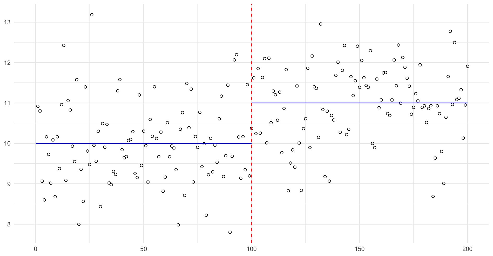

# Master's Thesis: 'A Likelihood Ratio Framework for Change Point Detection with Applications to Financial Time Series'

## Overview 
This report uses a likelihood ratio framework to develop methods for detecting changes in the mean and variance of a time series. We begin by considering a single change point under a univariate signal-plus-noise model and extend this to cover multiple change points and multivariate and high-dimensional data, with parallels drawn to the Bayesian paradigm. We subsequently relax the independence assumption through autoregressive and vector autoregressive models, which capture temporal and cross-sectional dependence respectively. We derive thresholds for the
limiting behaviour of the generalised log-likelihood ratio test statistic and align these with established information criteria. The methods are applied to S&P 500 returns and a portfolio of stocks during the period 2018-2022. Multiple detection algorithms consistently identify a change point in February 2020 corresponding to the onset of the COVID-19 pandemic, with INSPECT identifying airline, energy, and financial
stocks as the drivers of this change, consistent with the impact of travel restrictions, the oil price crash, and financial uncertainty during the pandemic.

## Supplementary Poster and Presentation

### Presentation 

### Poster

## Methodology 
### CUSUM Statistic 
For a time series $X_t$, the CUSUM statistic is given by:
$C_k(X) = \frac{1}{\sigma} \sqrt{\frac{k(n-k)}{n}} |{X_{1:k}-X_{k+1:n}}|$
This is implemented with examples in `src/cusumex.R`, producing the following plots for n=200, with a change in mean at t=100.
 

This project implements the following algorithms from scratch:
* Binary Segmentation (BinSeg)
* Bottom-Up [https://www.youtube.com/watch?v=eCNi8ouTpiI](Bottom Up Video)
* Sliding Window 

The methods discussed are then applied to S&P500 data and mixed stock data.

## Repository Structure 
* `src/methods` : Core implementation (e.g. `binary_segmentation.R`)
* `src/utils` : Helper functions for data loading, preprocessing, generating plots
* `scripts/analysis` : Standalone scripts for S&P application (`data_application_snp.R`) and stock portfolio application (`data_application_mixed.R`)
* `thesis/` : Full PDF thesis and all visualisations

## Reproducing the experiments 
A WRDS subscription is required. Alternative data (TODO) 

## Summary 
(Add plots) 
